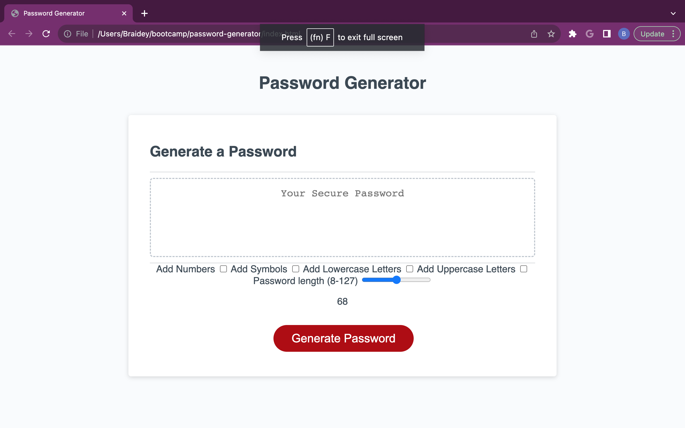

# Random Password Generator

## Description

This application creates a mathmatically random password while including/excluding various fields such as numbers, lowercase letters, uppercase letters, special characters. While giving the user those options, this app provides the user with a slidebar, giving them the choice of how long the password may be; with the minimum being 8 characters and the maximum being 127.

## Installation

To run this site, the user must first open any internet browser and supply it with the URL leading to the webpage.

## Usage

To effectively use this application, one must first specify the required fields desired and an appropriate password length. Once this step is completed, the user may click "Generate Password" button. Once completed, the desired password will appear in the middle box.

Live Site URl: https://braideyh.github.io/Random-Password-Generator/

## Credits

Started code was provided from https://github.com/coding-boot-camp/friendly-parakeet 
